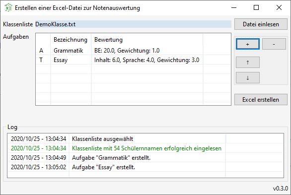
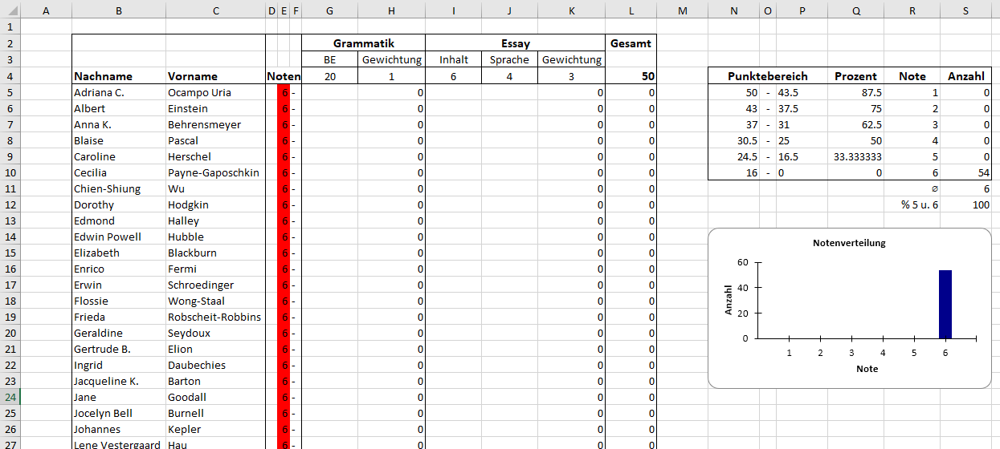

# Notenberechnung

## Deutsch
Mithilfe dieses kostenlosen Programms können Sie ganz einfach eine Vorlage zur Auswertung einer Schulaufgabe oder Stegreifaufgabe erstellen.
Sie benötigen dafür nur die Klassenliste als .txt-Datei auf ihrem Rechner.
Ein Beispiel für eine Klassenliste finden Sie weiter unten.

Benutzeroberfläche<br>


Erstelle Vorlage in MS Excel<br>


Beispiel für eine Klassenliste in der Datei DemoKlasse.txt.
Vor- und Nachname(n) können durch Kommas oder Tabs getrennt werden.
```
Adriana C. , Ocampo Uria
Albert, Einstein
Anna K., Behrensmeyer
Blaise, Pascal
Caroline, Herschel
Cecilia, Payne-Gaposchkin
```


## English
Program that creates a template for evaluating a test, e.g. to evaluate a school assignment.
All you need is a list of the student names in a .txt-file stored on your device.
